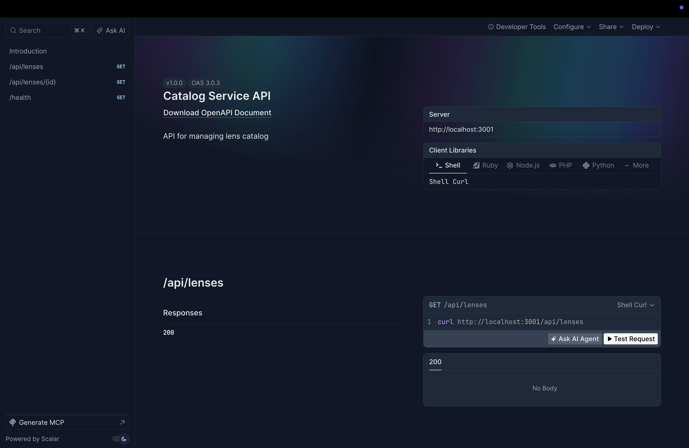
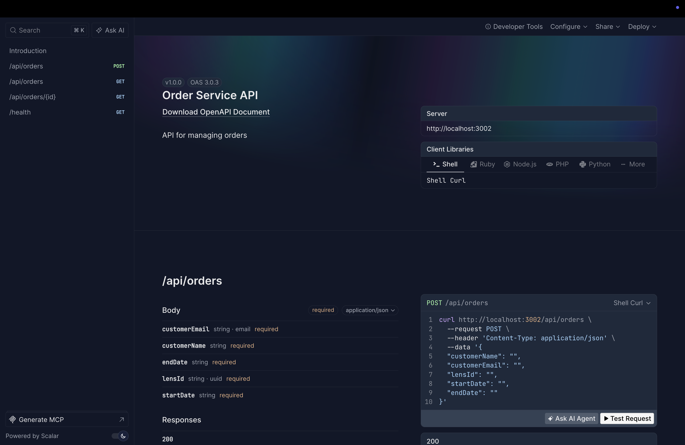
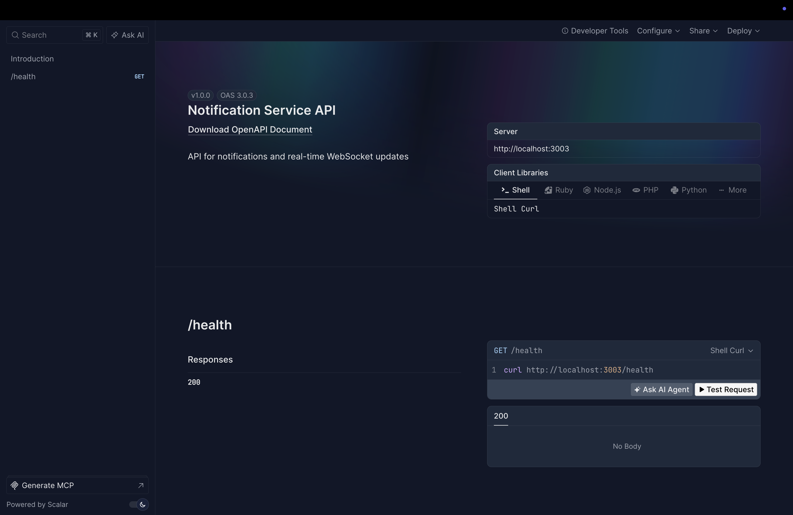
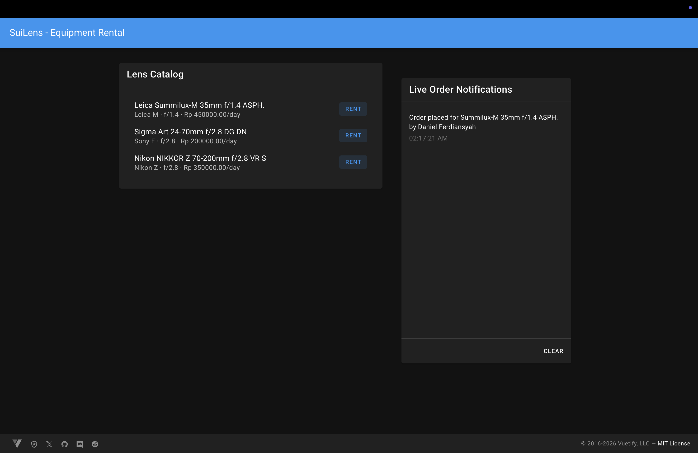
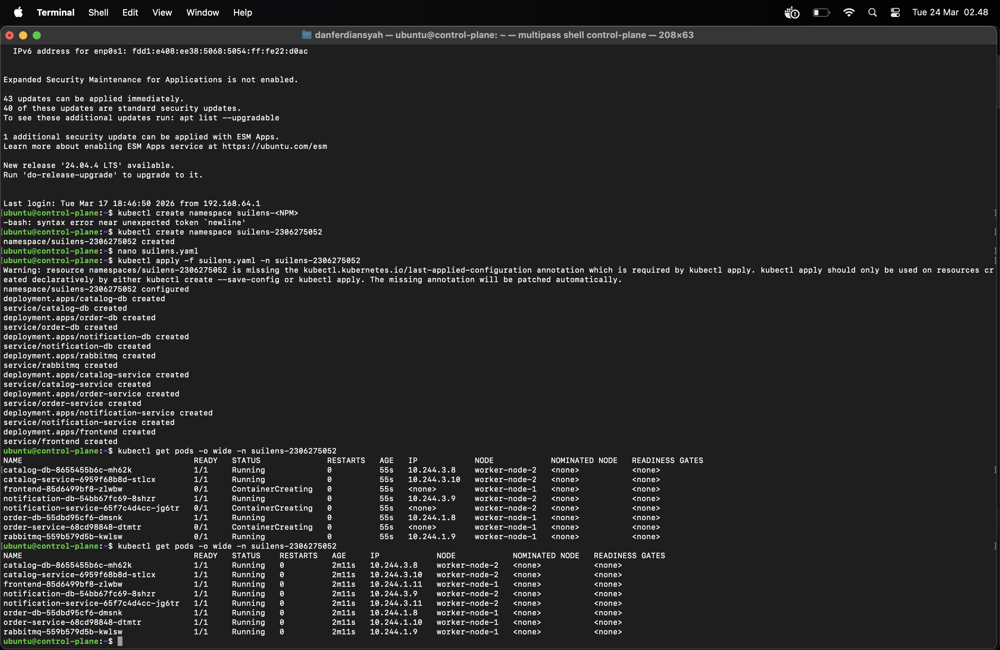

# Assignment A03 - SuiLens Microservices

Project ini merupakan implementasi Microservices, OpenAPI, WebSocket, dan On-Premise Kubernetes Deployment untuk Assignment A03.

---

## Identitas
* **Nama:** Daniel Ferdiansyah
* **NPM:** 2306275052

---

## Docker Hub Repository Links
* Catalog Service: [https://hub.docker.com/r/danferdiansyah/suilens-catalog](https://hub.docker.com/r/danferdiansyah/suilens-catalog)
* Order Service: [https://hub.docker.com/r/danferdiansyah/suilens-order](https://hub.docker.com/r/danferdiansyah/suilens-order)
* Notification Service: [https://hub.docker.com/r/danferdiansyah/suilens-notification](https://hub.docker.com/r/danferdiansyah/suilens-notification)
* Frontend: [https://hub.docker.com/r/danferdiansyah/suilens-frontend](https://hub.docker.com/r/danferdiansyah/suilens-frontend)

---

## Dokumentasi Tugas

### 1. OpenAPI (Swagger) Documentation
Berikut adalah hasil *generate* OpenAPI UI untuk masing-masing *service*:

**Catalog Service:**


**Order Service:**


**Notification Service:**


### 2. Live Order Notifications (WebSocket)
Implementasi WebSocket berhasil dilakukan. Notifikasi muncul secara *real-time* di *frontend* tanpa perlu memuat ulang halaman:


### 3. Kubernetes Deployment
Aplikasi berhasil di-*deploy* ke On-Premise Kubernetes *cluster* menggunakan Multipass, k3s, MetalLB, dan Flannel CNI. Berikut adalah status pod di dalam namespace `suilens-2306275052`:


---

# suilens-microservice-tutorial

Microservices tutorial implementation for Assignment 1 Part 2.2.

## Run

```bash
docker compose up --build -d
```

## Migrate + Seed (from host)

```bash
(cd services/catalog-service && bun install --frozen-lockfile && bunx drizzle-kit push)
(cd services/order-service && bun install --frozen-lockfile && bunx drizzle-kit push)
(cd services/notification-service && bun install --frozen-lockfile && bunx drizzle-kit push)
(cd services/catalog-service && bun run src/db/seed.ts)
```

## Smoke Test

```bash
curl http://localhost:3001/api/lenses | jq
LENS_ID=$(curl -s http://localhost:3001/api/lenses | jq -r '.[0].id')

curl -X POST http://localhost:3002/api/orders \
  -H "Content-Type: application/json" \
  -d '{
    "customerName": "Budi Santoso",
    "customerEmail": "budi@example.com",
    "lensId": "'"$LENS_ID"'",
    "startDate": "2025-03-01",
    "endDate": "2025-03-05"
  }' | jq

docker compose logs notification-service --tail 20
```

## Stop

```bash
docker compose down
```
